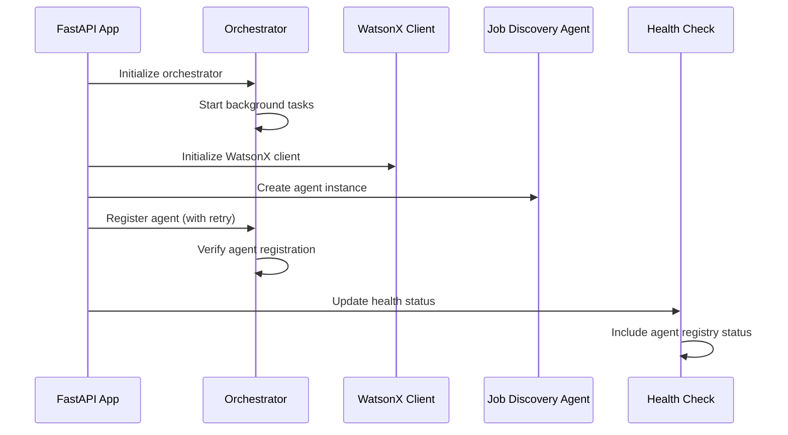

# Design Document

## Overview

The agent registration issue stems from a timing problem in the application startup sequence. The orchestrator needs to be fully initialized before agents can be registered, but the current implementation may have race conditions or incomplete initialization. This design addresses the root cause and implements a robust agent registration system.

## Architecture

### Current Issue Analysis

1. **Timing Problem**: The orchestrator may not be fully started when agents try to register
2. **Missing Error Handling**: No fallback mechanism when agent registration fails
3. **Initialization Order**: Dependencies between orchestrator, WatsonX client, and agents not properly sequenced
4. **State Verification**: No verification that agents are actually registered successfully

### Proposed Solution Architecture



## Components and Interfaces

### 1. Enhanced Orchestrator Initialization

**Interface**: `AgentOrchestrator`
- Add `is_ready` property to track initialization state
- Add `wait_for_ready()` method for dependent components
- Enhance `register_agent()` with validation and retry logic
- Add `get_registered_agents()` for status checking

### 2. Agent Registration Manager

**New Component**: `AgentRegistrationManager`
- Handles agent registration with retry logic
- Validates successful registration
- Provides registration status reporting
- Manages registration dependencies

### 3. Startup Sequence Controller

**Enhanced Component**: Application lifespan manager
- Ensures proper initialization order
- Waits for dependencies before proceeding
- Provides detailed startup logging
- Handles initialization failures gracefully

### 4. Health Check Enhancement

**Enhanced Component**: Health check endpoint
- Include agent registration status
- Report which agents are available
- Provide orchestrator readiness status
- Show initialization timing information

## Data Models

### Agent Registration Status

```python
@dataclass
class AgentRegistrationStatus:
    agent_id: str
    is_registered: bool
    registration_time: datetime
    last_health_check: datetime
    error_message: Optional[str]
    retry_count: int
```

### Orchestrator State

```python
@dataclass
class OrchestratorState:
    is_initialized: bool
    is_ready: bool
    registered_agents: Dict[str, AgentRegistrationStatus]
    startup_time: datetime
    last_health_check: datetime
```

## Error Handling

### Registration Failures

1. **Retry Logic**: Implement exponential backoff for failed registrations
2. **Fallback Behavior**: Provide mock responses when agents unavailable
3. **Error Reporting**: Log detailed error information for troubleshooting
4. **Graceful Degradation**: Continue startup even if some agents fail to register

### Runtime Failures

1. **Agent Health Monitoring**: Regular health checks for registered agents
2. **Automatic Re-registration**: Attempt to re-register failed agents
3. **Circuit Breaker**: Temporarily disable problematic agents
4. **User Feedback**: Provide meaningful error messages to users

## Testing Strategy

### Unit Tests

1. **Orchestrator Initialization**: Test startup sequence and state management
2. **Agent Registration**: Test successful and failed registration scenarios
3. **Error Handling**: Test retry logic and fallback behavior
4. **Health Checks**: Test status reporting accuracy

### Integration Tests

1. **Full Startup Sequence**: Test complete application initialization
2. **Agent Communication**: Test orchestrator-agent interaction
3. **Error Recovery**: Test system behavior during failures
4. **Performance**: Test startup time and resource usage

### End-to-End Tests

1. **Job Discovery Flow**: Test complete user workflow
2. **Error Scenarios**: Test user experience during agent failures
3. **System Recovery**: Test system behavior after restarts
4. **Load Testing**: Test system behavior under load

## Implementation Approach

### Phase 1: Core Fixes
- Fix orchestrator initialization timing
- Add proper error handling to agent registration
- Implement registration validation

### Phase 2: Enhanced Monitoring
- Add comprehensive health checks
- Implement agent status reporting
- Add startup sequence logging

### Phase 3: Robustness Features
- Add retry logic and fallback behavior
- Implement automatic recovery mechanisms
- Add performance monitoring

## Security Considerations

1. **Agent Authentication**: Ensure only authorized agents can register
2. **Resource Protection**: Prevent resource exhaustion from failed registrations
3. **Error Information**: Avoid exposing sensitive information in error messages
4. **Access Control**: Restrict access to agent management endpoints