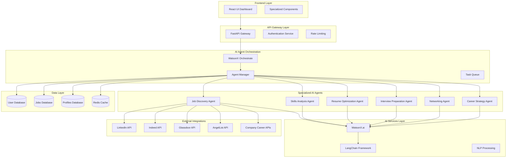

# Design Document

## Overview

JobSwitch.ai is a comprehensive AI-powered career copilot platform that leverages a network of specialized AI agents to provide end-to-end career support. The platform is built using a modern tech stack with React frontend, FastAPI backend, WatsonX.ai for AI capabilities, WatsonX Orchestrate for agent coordination, and LangChain for AI workflow management.

The system follows a microservices-oriented architecture where specialized AI agents handle different aspects of career development, all coordinated through a central orchestration layer. The platform integrates with major job boards and provides personalized recommendations, resume optimization, interview preparation, and career strategy development.

## Architecture

### High-Level Architecture



### Agent Architecture

Each AI agent follows a consistent pattern:
- **Input Processing**: Receives user requests and context
- **AI Processing**: Uses WatsonX.ai and LangChain for intelligent processing
- **External Integration**: Connects to relevant external APIs
- **Output Generation**: Provides structured responses and recommendations
- **State Management**: Maintains conversation context and user preferences

## Components and Interfaces

### Frontend Components

#### 1. Dashboard Component
- **Purpose**: Central hub showing all AI agent activities and recommendations
- **Features**: Real-time updates, agent status indicators, quick actions
- **State Management**: React Context for global state, local state for component-specific data

#### 2. Job Discovery Interface
- **Purpose**: Display job recommendations and search functionality
- **Features**: Job cards, filtering, saved jobs, application tracking
- **Integration**: Real-time updates from Job Discovery Agent

#### 3. Skills Analysis Dashboard
- **Purpose**: Visualize skill gaps and development recommendations
- **Features**: Skill radar charts, progress tracking, learning path visualization
- **Integration**: Skills Analysis Agent data and recommendations

#### 4. Resume Builder Interface
- **Purpose**: Create and optimize resumes for specific jobs
- **Features**: Drag-and-drop editor, ATS optimization indicators, multiple templates
- **Integration**: Resume Optimization Agent for real-time suggestions

#### 5. Interview Preparation Studio
- **Purpose**: Conduct mock interviews with AI feedback
- **Features**: Video/audio recording, real-time feedback, question bank
- **Integration**: Interview Preparation Agent with WebRTC for video/audio

#### 6. Networking Hub
- **Purpose**: Manage outreach campaigns and networking activities
- **Features**: Contact management, email templates, campaign tracking
- **Integration**: Networking Agent for automated outreach

#### 7. Career Strategy Planner
- **Purpose**: Long-term career planning and goal tracking
- **Features**: Timeline visualization, milestone tracking, strategy recommendations
- **Integration**: Career Strategy Agent for personalized roadmaps

### Backend API Endpoints

#### Core API Structure
```
/api/v1/
├── auth/
│   ├── login
│   ├── register
│   └── refresh
├── agents/
│   ├── job-discovery/
│   ├── skills-analysis/
│   ├── resume-optimization/
│   ├── interview-preparation/
│   ├── networking/
│   └── career-strategy/
├── user/
│   ├── profile
│   ├── preferences
│   └── history
├── jobs/
│   ├── search
│   ├── recommendations
│   └── applications
└── integrations/
    ├── linkedin
    ├── indeed
    ├── glassdoor
    └── angellist
```

#### Agent-Specific Endpoints

**Job Discovery Agent**
- `POST /api/v1/agents/job-discovery/search` - Search jobs across platforms
- `GET /api/v1/agents/job-discovery/recommendations` - Get personalized recommendations
- `POST /api/v1/agents/job-discovery/save-job` - Save job for later review

**Skills Analysis Agent**
- `POST /api/v1/agents/skills-analysis/analyze` - Analyze user skills vs job requirements
- `GET /api/v1/agents/skills-analysis/gaps` - Get skill gap analysis
- `POST /api/v1/agents/skills-analysis/learning-path` - Generate learning recommendations

**Resume Optimization Agent**
- `POST /api/v1/agents/resume-optimization/optimize` - Optimize resume for specific job
- `GET /api/v1/agents/resume-optimization/score` - Get ATS compatibility score
- `POST /api/v1/agents/resume-optimization/generate` - Generate new resume version

**Interview Preparation Agent**
- `POST /api/v1/agents/interview-preparation/mock-interview` - Start mock interview session
- `GET /api/v1/agents/interview-preparation/questions` - Get role-specific questions
- `POST /api/v1/agents/interview-preparation/feedback` - Submit interview for feedback

**Networking Agent**
- `POST /api/v1/agents/networking/find-contacts` - Find relevant contacts at companies
- `POST /api/v1/agents/networking/generate-email` - Generate personalized outreach emails
- `GET /api/v1/agents/networking/campaigns` - Get outreach campaign status

**Career Strategy Agent**
- `POST /api/v1/agents/career-strategy/roadmap` - Generate career roadmap
- `GET /api/v1/agents/career-strategy/goals` - Get career goals and progress
- `POST /api/v1/agents/career-strategy/update-goals` - Update career objectives

### AI Agent Interfaces

#### Base Agent Interface
```python
class BaseAgent:
    def __init__(self, watsonx_client, langchain_config):
        self.watsonx = watsonx_client
        self.langchain = langchain_config
        self.context = {}
    
    async def process_request(self, user_input, context):
        """Process user request and return structured response"""
        pass
    
    async def update_context(self, new_context):
        """Update agent context with new information"""
        pass
    
    async def get_recommendations(self, user_profile):
        """Generate personalized recommendations"""
        pass
```

#### Agent Communication Protocol
- **Message Format**: JSON-based structured messages
- **Context Sharing**: Shared context store for inter-agent communication
- **Event System**: Pub/sub pattern for agent coordination
- **Error Handling**: Standardized error responses and fallback mechanisms

## Data Models

### User Profile Model
```python
class UserProfile:
    user_id: str
    personal_info: PersonalInfo
    skills: List[Skill]
    experience: List[Experience]
    education: List[Education]
    preferences: UserPreferences
    career_goals: CareerGoals
    created_at: datetime
    updated_at: datetime
```

### Job Model
```python
class Job:
    job_id: str
    title: str
    company: str
    location: str
    description: str
    requirements: List[str]
    salary_range: SalaryRange
    source: str  # LinkedIn, Indeed, etc.
    posted_date: datetime
    application_deadline: datetime
    compatibility_score: float
```

### Resume Model
```python
class Resume:
    resume_id: str
    user_id: str
    version: int
    content: ResumeContent
    target_job_id: str
    ats_score: float
    optimization_suggestions: List[str]
    created_at: datetime
```

### Interview Session Model
```python
class InterviewSession:
    session_id: str
    user_id: str
    job_role: str
    questions: List[InterviewQuestion]
    responses: List[InterviewResponse]
    feedback: InterviewFeedback
    video_url: str
    audio_url: str
    created_at: datetime
```

### Networking Campaign Model
```python
class NetworkingCampaign:
    campaign_id: str
    user_id: str
    target_company: str
    contacts: List[Contact]
    email_templates: List[EmailTemplate]
    sent_emails: List[SentEmail]
    responses: List[EmailResponse]
    status: CampaignStatus
    created_at: datetime
```

### Career Roadmap Model
```python
class CareerRoadmap:
    roadmap_id: str
    user_id: str
    current_role: str
    target_role: str
    milestones: List[Milestone]
    skills_to_develop: List[Skill]
    timeline: Timeline
    progress: float
    created_at: datetime
    updated_at: datetime
```

## Error Handling

### Error Categories
1. **User Input Errors**: Invalid data, missing required fields
2. **External API Errors**: Third-party service failures, rate limiting
3. **AI Processing Errors**: Model failures, timeout errors
4. **System Errors**: Database failures, network issues

### Error Response Format
```json
{
    "error": {
        "code": "ERROR_CODE",
        "message": "Human-readable error message",
        "details": "Additional error details",
        "timestamp": "2025-01-08T10:00:00Z",
        "request_id": "unique-request-id"
    }
}
```

### Fallback Mechanisms
- **Agent Fallback**: If primary agent fails, route to backup processing
- **API Fallback**: Alternative data sources when primary APIs fail
- **Graceful Degradation**: Reduced functionality when services are unavailable
- **Retry Logic**: Exponential backoff for transient failures

## Testing Strategy

### Unit Testing
- **Agent Testing**: Mock WatsonX.ai responses, test agent logic
- **API Testing**: Test all endpoints with various input scenarios
- **Component Testing**: React component testing with Jest and React Testing Library
- **Model Testing**: Validate data models and business logic

### Integration Testing
- **Agent Integration**: Test agent communication and coordination
- **API Integration**: Test external API integrations with mock services
- **Database Integration**: Test data persistence and retrieval
- **End-to-End Workflows**: Test complete user journeys

### Performance Testing
- **Load Testing**: Test system under high user load
- **AI Response Time**: Measure and optimize AI processing times
- **Database Performance**: Query optimization and indexing
- **Caching Strategy**: Test cache effectiveness and invalidation

### Security Testing
- **Authentication Testing**: Test JWT token handling and validation
- **Authorization Testing**: Verify role-based access controls
- **Data Protection**: Test encryption and data anonymization
- **API Security**: Test rate limiting and input validation

### Testing Tools and Frameworks
- **Backend**: pytest, FastAPI TestClient, mock libraries
- **Frontend**: Jest, React Testing Library, Cypress for E2E
- **AI Testing**: Custom test harnesses for agent behavior
- **Performance**: Locust for load testing, APM tools for monitoring

### Continuous Integration
- **Automated Testing**: Run all test suites on code changes
- **Code Quality**: ESLint, Prettier, Black for code formatting
- **Security Scanning**: Automated vulnerability scanning
- **Deployment Testing**: Test deployments in staging environment

### Test Data Management
- **Mock Data**: Comprehensive test datasets for all scenarios
- **Data Privacy**: Anonymized production data for testing
- **Test Isolation**: Independent test environments
- **Data Cleanup**: Automated cleanup of test data

This design provides a comprehensive foundation for building the JobSwitch.ai platform with all the specified features while maintaining scalability, reliability, and user experience standards.